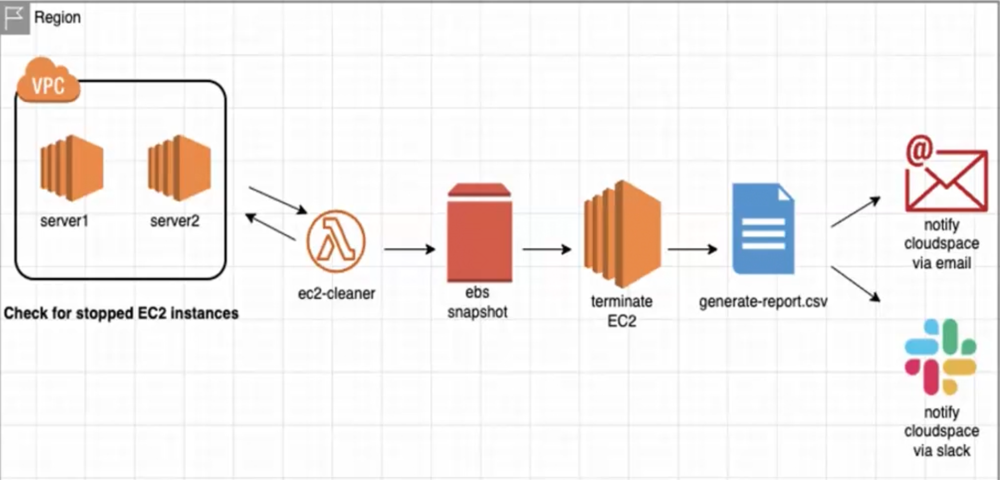
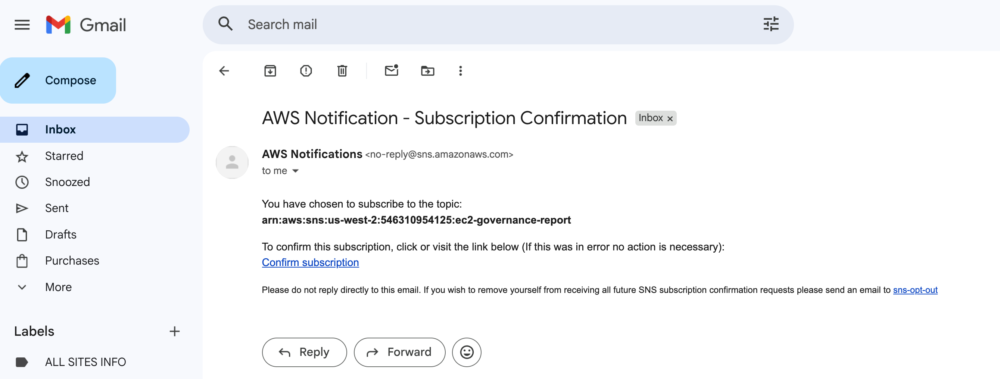
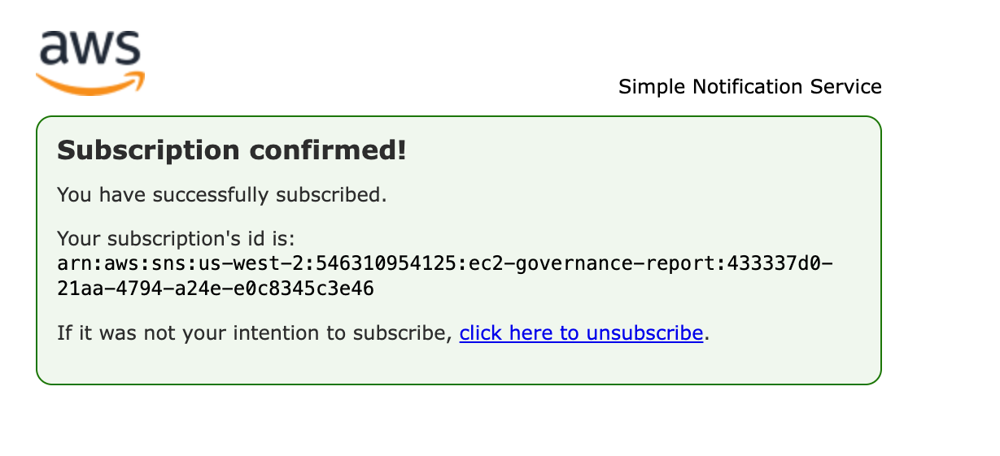
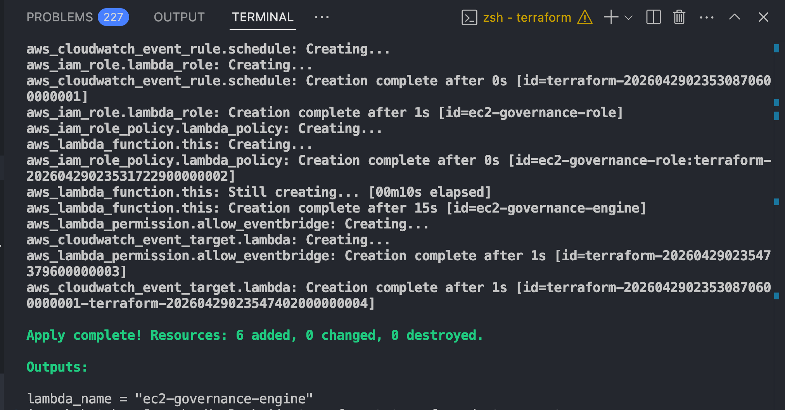
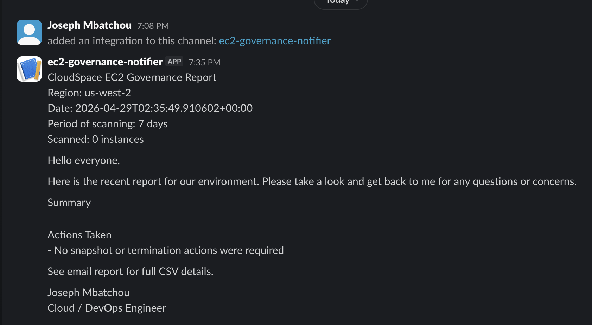
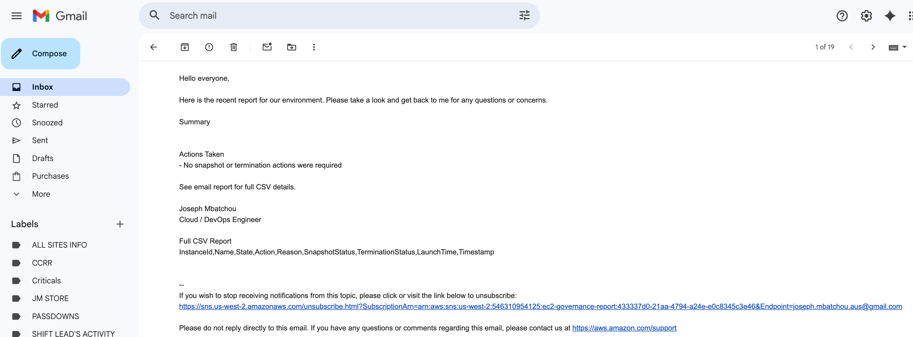

# EC2 Governance Engine

Automated AWS EC2 governance project built with Python, Terraform, AWS Lambda, EventBridge, SNS, Slack, and S3.



## Overview

This project scans EC2 instances in `us-west-2`, evaluates their state, creates EBS snapshots for approved states, optionally terminates approved instances, generates a CSV report, uploads that report to S3, and sends notifications by email and Slack.

Current default policy:

- Scan all EC2 instance statuses
- Snapshot `stopped` instances
- Terminate `stopped` instances after snapshot creation
- Send a summary message to Slack
- Send the same summary plus full CSV content to SNS email
- Upload the CSV report to S3 and share a pre-signed download link

## Architecture

EventBridge → Lambda → EC2/EBS → S3 Report → SNS Email + Slack

## Features

- Scan all EC2 instance states in the target region
- Classify instances by policy
- Create EBS snapshots for selected states
- Terminate only approved states
- Generate CSV reports for every run
- Upload CSV reports to S3
- Send report notifications to email and Slack
- Deploy and destroy with Terraform
- Support GitHub Actions deploy and destroy workflows

## Project Structure

```text
.
├── .github/workflows/
│   ├── deploy.yml
│   └── destroy.yml
├── lambda/
│   ├── lambda_function.py
│   └── requirements.txt
├── scripts/
│   ├── package.sh
│   └── destroy.sh
└── terraform/
    ├── backend.tf
    ├── main.tf
    ├── outputs.tf
    ├── providers.tf
    ├── terraform.tfvars
    ├── terraform.tfvars.example
    └── variables.tf
```

## Notification Behavior

Slack receives:

- A formatted summary message
- Region
- Date
- Scan period
- Instance counts by state
- Actions taken
- A pre-signed S3 link to download the CSV report

SNS email receives:

- The same summary message
- The same pre-signed S3 link
- The full CSV content in the email body

Important:

- SNS topic email delivery does not support normal file attachments for this workflow
- Slack incoming webhooks do not upload files directly
- Because of that, this project uses S3 plus a pre-signed download link instead of a true attachment

## Default AWS Region

The default region is:

```text
us-west-2
```

## Prerequisites

Before running the project, make sure you have:

- An AWS account
- AWS CLI configured locally
- Terraform installed
- Python 3 installed
- `zip` installed
- An existing S3 bucket for Terraform backend state
- An existing S3 bucket for CSV reports
- An SNS topic with a confirmed email subscription
- A Slack incoming webhook





## Required AWS Resources

You must have these resources available before deployment:

1. Terraform backend S3 bucket
2. SNS topic ARN
3. Confirmed SNS email subscription
4. Slack webhook URL
5. CSV report bucket

In your current setup:

- SNS topic ARN: stored locally in `terraform/terraform.tfvars`
- Slack webhook: stored locally in `terraform/terraform.tfvars`
- CSV report bucket: `python-ec2-report-generator-bucket1`

## Configuration

### 1. Terraform Backend

Update [terraform/backend.tf](/Users/josephmbatchou/Documents/ec2-governance/terraform/backend.tf:1) with your real Terraform state bucket name.

Example:

```hcl
terraform {
  backend "s3" {
    bucket = "your-real-terraform-state-bucket"
    key    = "ec2-governance/terraform.tfstate"
    region = "us-west-2"
  }
}
```

### 2. Terraform Variables

Local secrets and settings are stored in:

[terraform/terraform.tfvars](/Users/josephmbatchou/Documents/ec2-governance/terraform/terraform.tfvars:1)

The example template is:

[terraform/terraform.tfvars.example](/Users/josephmbatchou/Documents/ec2-governance/terraform/terraform.tfvars.example:1)

Current variables:

- `sns_topic_arn`
- `slack_webhook`
- `report_bucket_name`
- `snapshot_states`
- `terminate_states`

## Local Setup

### 1. Configure AWS CLI

```bash
aws configure
```

Use credentials that have access to:

- Lambda
- IAM
- EventBridge
- EC2
- EBS snapshots
- SNS
- S3

### 2. Confirm SNS Email Subscription

Make sure the subscription was confirmed from your email inbox. If it is still pending confirmation, email notifications will not work.

### 3. Check the Report Bucket

Make sure this bucket exists in `us-west-2`:

```text
python-ec2-report-generator-bucket1
```

## Local Deployment Workflow

### 1. Package the Lambda

```bash
cd /Users/josephmbatchou/Documents/ec2-governance
bash scripts/package.sh
```

### 2. Initialize Terraform

```bash
cd /Users/josephmbatchou/Documents/ec2-governance/terraform
terraform init
```

### 3. Deploy the Infrastructure

```bash
terraform apply
```



## Manual Test Workflow

After deployment, you can test immediately instead of waiting for the daily schedule.

### 1. Invoke the Lambda

```bash
aws lambda invoke \
  --function-name ec2-governance-engine \
  --region us-west-2 \
  response.json
```

### 2. Inspect the Lambda Response

```bash
cat response.json
```

Expected result:

```json
{"statusCode": 200}
```

### 3. Verify Outputs

Check the following:

- Slack channel for the summary message
- Email inbox for the SNS message
- S3 bucket for the generated CSV file
- CloudWatch Logs for Lambda execution logs
- EC2 console for snapshot and termination behavior





## Where the CSV Report Goes

CSV reports are uploaded to the S3 report bucket using keys like:

```text
reports/ec2-governance-report-2026-04-28T18-30-00Z.csv
```

The Slack and email messages include a pre-signed download link for that file.

## Scheduled Execution

The Lambda is triggered daily by EventBridge.

Current schedule:

```text
rate(1 day)
```

## Destroy Workflow

### Local Destroy

To remove the Terraform-managed resources after testing:

```bash
cd /Users/josephmbatchou/Documents/ec2-governance
bash scripts/destroy.sh
```

This destroys Terraform-managed resources such as:

- Lambda
- IAM role and policy
- EventBridge rule and target
- Lambda permission

Important:

- Resources not created by Terraform are not destroyed automatically
- If your SNS topic or report bucket were created outside Terraform, they will remain


## GitHub Actions

This repo includes two workflows:

- [deploy.yml](/Users/josephmbatchou/Documents/ec2-governance/.github/workflows/deploy.yml:1): deploys automatically on push to `main`
- [destroy.yml](/Users/josephmbatchou/Documents/ec2-governance/.github/workflows/destroy.yml:1): destroys manually from the GitHub Actions UI

### Required GitHub Secrets

Add these repository secrets before using GitHub Actions:

- `AWS_ACCESS_KEY`
- `AWS_SECRET_KEY`
- `SNS_TOPIC_ARN`
- `SLACK_WEBHOOK`
- `REPORT_BUCKET_NAME`

### GitHub Deploy Workflow

1. Create the GitHub repository
2. Push this project to the `main` branch
3. Add the required GitHub secrets
4. Push a commit to `main`
5. Open the `Actions` tab
6. Watch `Deploy EC2 Governance`

### GitHub Destroy Workflow

1. Open the GitHub repository
2. Go to `Actions`
3. Select `Destroy EC2 Governance`
4. Click `Run workflow`

## Current Policy Logic

The Lambda currently behaves like this:

- `running`: marked healthy or review-long-running
- `stopped`: snapshot and terminate by default
- `pending`, `stopping`, `shutting-down`, `rebooting`: marked as transition
- `terminated`: ignored
- missing `Owner` tag on otherwise unhandled states: marked non-compliant

Main implementation file:

[lambda/lambda_function.py](/Users/josephmbatchou/Documents/ec2-governance/lambda/lambda_function.py:1)

## Security Notes

- `terraform/terraform.tfvars` is ignored by Git and should remain local
- Slack webhooks are secrets and should never be committed
- If a webhook is exposed, rotate it in Slack and update `terraform/terraform.tfvars`
- AWS credentials should never be committed
- GitHub Actions should use repository secrets, not hardcoded values

## Useful Commands

Package Lambda:

```bash
bash scripts/package.sh
```

Deploy:

```bash
cd terraform
terraform init
terraform apply
```

Destroy:

```bash
bash scripts/destroy.sh
```

Format Terraform:

```bash
terraform fmt -recursive
```

## Troubleshooting

### No email received

- Confirm the SNS subscription
- Check the SNS topic ARN in `terraform.tfvars`
- Check Lambda CloudWatch logs

### No Slack message received

- Confirm the webhook URL is valid
- Make sure the webhook is still active
- Check Lambda CloudWatch logs

### No CSV file visible

- Check that `report_bucket_name` is set
- Confirm the bucket exists in `us-west-2`
- Verify the Lambda IAM policy includes S3 access
- Check the `reports/` prefix in the S3 bucket

### Terraform apply fails

- Verify AWS credentials
- Verify the backend bucket exists
- Run `terraform fmt -recursive`
- Re-run `terraform init`

## Next Improvements

Possible future upgrades:

- Manage the report bucket with Terraform
- Add `source_code_hash` to the Lambda resource
- Use Amazon SES for true email attachments
- Use a Slack bot token for real Slack file uploads
- Add tests for policy behavior

## 🤝 Contribution

Pull requests are welcome. For major changes, please open an issue first.

## 👨‍💻 Author

**Joseph Mbatchou**

• DevOps / Cloud / Platform  Engineer   
• Content Creator / AWS Builder

## 🔗 Connect With Me

🌐 Website: [https://platform.joebahocloud.com](https://platform.joebahocloud.com)

💼 LinkedIn: [https://www.linkedin.com/in/josephmbatchou/](https://www.linkedin.com/in/josephmbatchou/)

🐦 X/Twitter: [https://www.twitter.com/Joebaho237](https://www.twitter.com/Joebaho237)

▶️ YouTube: [https://www.youtube.com/@josephmbatchou5596](https://www.youtube.com/@josephmbatchou5596)

🔗 Github: [https://github.com/Joebaho](https://github.com/Joebaho)

📦 Dockerhub: [https://hub.docker.com/u/joebaho2](https://hub.docker.com/u/joebaho2)

---

## 📄 License

This project is licensed under the MIT License — see the LICENSE file for details.
